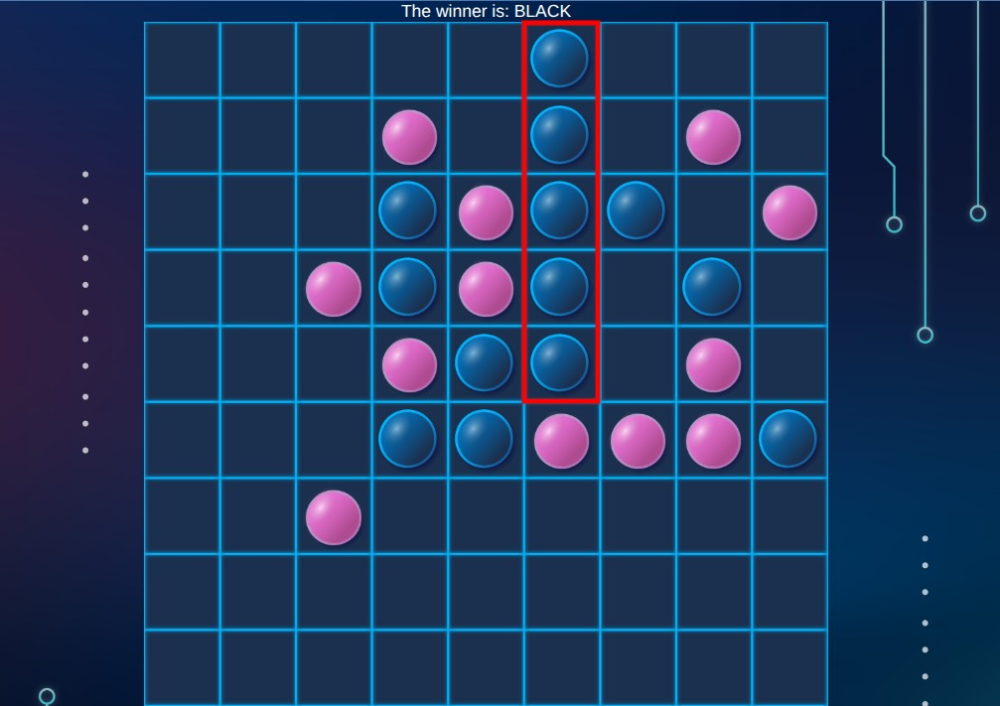

# Gomoku Web Game

A fully functional web-based Gomoku game featuring:
- PvP and AI game modes 
- Custom player symbols (pink/blue instead of white/black) and responsive UI in colors of my portfolio website (https://mariia-shmidt-portfolio.com/)
- Java Spring Boot backend + vanilla JS frontend 
- Mobile-friendly interface 

---

## About This Project

This project was started during Data Structures & Algorithms course (COMP2080) in George Brown College as a basic console game and evolved into a full-stack web application.
            The original development team included:
            - Eduard Kosenko: Made game logic for two-players mode
            - Evgenii Baldin & Mateus Sfeir: Developed minimax algorithm for "AI" mode
            - Mariia Shmidt (me) and Leonard Eriyo: Implemented all the algorithms above and elaborated approachable UI for console game.
        Mark 15/15 was received :)
---

## Technologies Used

- **Backend**: Java 17, Spring Boot (REST API)
- **Frontend**: HTML5, CSS3, JavaScript, Font Awesome, Hover.css
- **Other**: Responsive design, modular HTML (with dynamic header injection)

---

## Setup Instructions

To run the project: *link*

